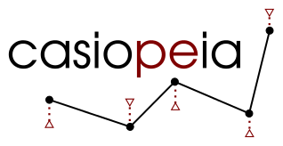

Casadi Interface for Optimum experimental design and Parameter Estimation and Identification Applications
---------------------------------------------------------------------------------------------------------

|travis| |coveralls| |rtd|

.. |travis| image:: https://travis-ci.org/adbuerger/casiopeia.svg?branch=master
    :target: https://travis-ci.org/adbuerger/casiopeia
    :alt: Travis CI build status master branch

.. |coveralls| image:: https://coveralls.io/repos/github/adbuerger/casiopeia/badge.svg?branch=master
    :target: https://coveralls.io/github/adbuerger/casiopeia?branch=master        
    :alt: Coverage Status

.. |rtd| image:: https://readthedocs.org/projects/casiopeia/badge/?version=latest
    :target: http://casiopeia.readthedocs.org/en/latest/?badge=latest
    :alt: Documentation Status

casiopeia holds a user-friendly environment for optimum experimental design and parameter estimation and identification applications. It does so by providing Python classes that can be initialized with the problem specifications, while the computations can then easily be performed using the available class functions.

**Please note:** casiopeia makes use of the optimization framework `CasADi <http://casadi.org>`_. For casiopeia to work, you need CasADi version >= 2.4.2 but (for the moment) <= 3.x to be installed on your system, otherwise the installation of casiopeia will abort.

casiopeia is still in it's testing state, and does not yet contain all the features it will provide in future versions. Therefore, you should check for updates on a regular basis.

For an installation guide, a tutorial on how to use casiopeia and a detailed documentation, please visit `the manual pages <http://casiopeia.readthedocs.io/>`_ .

**New and experimental:** `try casiopeia live in your browser <https://ec2-52-29-32-46.eu-central-1.compute.amazonaws.com:8888/41b11aa6-ece3-480d-91a5-d885f95a2680>`_ [#f1]_

.. [#f1] This service is at the moment limited to one user at a time, due to restricted resources. If your computations do no start immediately, there's probably another user testing casiopeia at the moment. 
