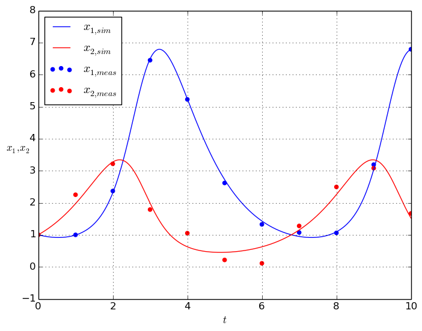
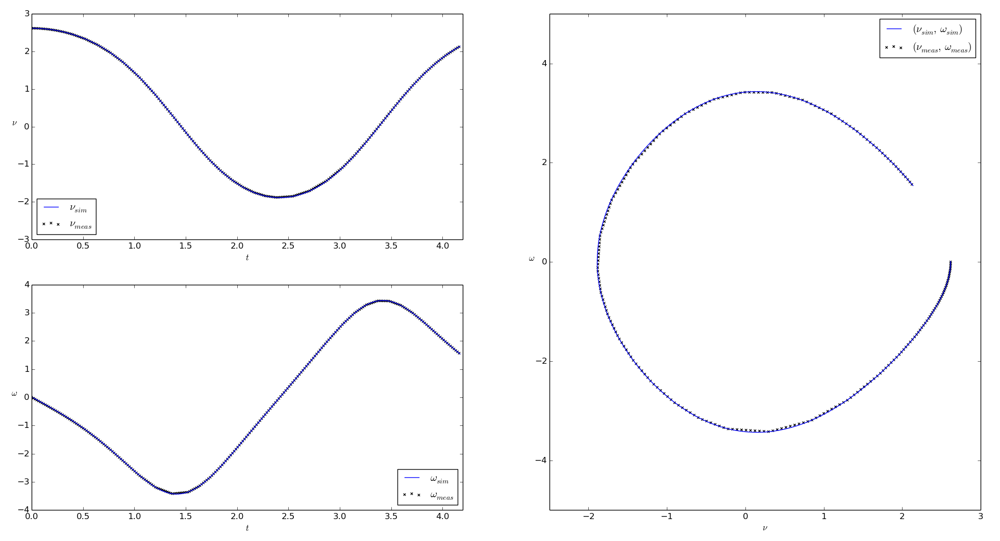
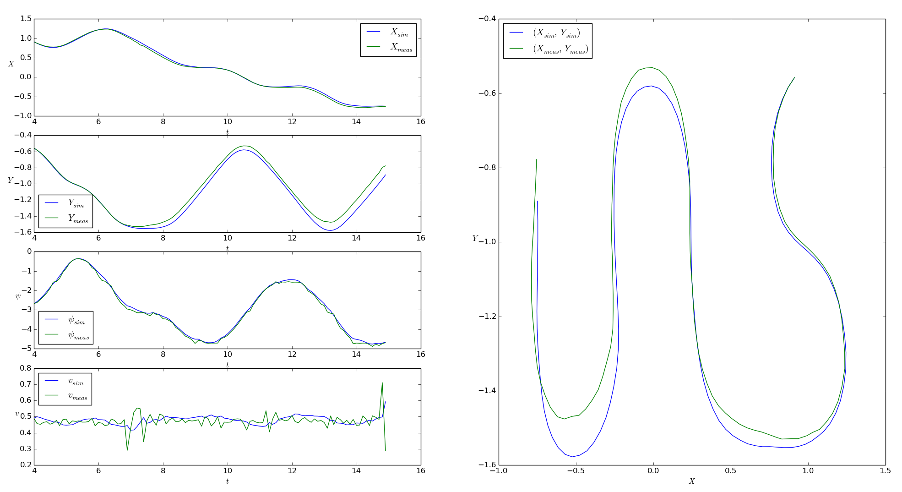

.. Copyright 2014-2015 Adrian Bürger
..
.. This file is part of PECas.
..
.. PECas is free software: you can redistribute it and/or modify
.. it under the terms of the GNU Lesser General Public License as published by
.. the Free Software Foundation, either version 3 of the License, or
.. (at your option) any later version.
..
.. PECas is distributed in the hope that it will be useful,
.. but WITHOUT ANY WARRANTY; without even the implied warranty of
.. MERCHANTABILITY or FITNESS FOR A PARTICULAR PURPOSE. See the
.. GNU Lesser General Public License for more details.
..
.. You should have received a copy of the GNU Lesser General Public License
.. along with PECas. If not, see <http://www.gnu.org/licenses/>.

.. _samples:

Sample applications
===================

The following sample applications give hands-on impressions on how to use casiopeia in practice. They all (and some more) are contained within the `examples directory <https://github.com/adbuerger/casiopeia/tree/master/examples>`_ of the casiopeia sources.

Parameter estimation for a Lotka-Volterra predator-prey-model
-------------------------------------------------------------

The aim of the application `lotka_volterra.py <https://github.com/adbuerger/casiopeia/blob/master/examples/lotka_volterra.py>`_ is to estimate the unknown parameters of a Lotka-Volterra predator-prey-model for experimentally received measurement data and given standard deviations for the measurements [#f1]_. The predator-prey-model is an ODE of the form :math:`\dot{x} = f(x,p)`, given by

.. math::

    \begin{aligned}
        \dot{x}_1 &= - \alpha x_1 + \beta x_1 x_2 \\
        \dot{x}_2 &= \gamma x_2 - \delta x_1 x_2 \\
    \end{aligned}

where :math:`\alpha = 1.0` and :math:`\gamma = 1.0`, the states :math:`x` and parameters :math:`p` are defined as 

.. math::

    x = \begin{pmatrix} {x_1} \\ {x_2} \end{pmatrix}, ~ p = \begin{pmatrix} {\beta} \\ {\delta} \end{pmatrix},

and we can measure the full state, i. e.  

.. math::

    \phi = x.

The values resulting from the parameter estimation are 

.. math::

    \hat{p} = \begin{pmatrix} {\hat{\beta}} \\ {\hat{\delta}} \end{pmatrix} = \begin{pmatrix} {0.693379029} \\ {0.341128482} \end{pmatrix}.

The results for the system simulation using the estimated parameters in comparison to the measurement data are shown in the figure below.

    Figure: Simulation results for the Lotka-Volterra predator-prey-model using the estimated parameters, compared to the given measurement data

Parameter estimation for a pendulum model
-----------------------------------------

The aim of the application `pendulum.py <https://github.com/adbuerger/casiopeia/blob/master/examples/pendulum.py>`_ is to estimate the spring constant :math:`k` of a pendulum model for experimentally received measurement data [#f2]_. The pendulum model is an ODE of the form :math:`\dot{x} = f(x,u,p)`, given by

.. math::

    \begin{aligned}
        \dot{\nu} &= \omega \\
        \dot{\omega} &= \frac{k}{m L^2} (\psi - \nu) - \frac{g}{L} * \sin(\nu)  \\
    \end{aligned}

where :math:`m = 1.0`, :math:`L = 3.0` and :math:`g = 9.81`, the states :math:`x`, controls :math:`u` and parameters :math:`p` are defined as

.. math::

    x = \begin{pmatrix} {\nu} \\ {\omega} \end{pmatrix}, ~ u = \begin{pmatrix} {\psi} \end{pmatrix}, ~ p = \begin{pmatrix} {k} \end{pmatrix},

while the only control :math:`\psi` is the initial actuation angle of the pendulum, and therefor stays constant over time. Also, we can measure the full state, i. e. 

.. math::

    \phi = x.

The value resulting from the parameter estimation is

.. math::

    \hat{p} = \begin{pmatrix} {\hat{k}}\end{pmatrix} = \begin{pmatrix} {2.99763513} \end{pmatrix}.

The results for the system simulation using the estimated parameter in comparison to the measurement data are shown in the figures below.

    Figure: Simulation results for the pedulum model using the estimated parameters, compared to the given measurement data

Parameter estimation for a model race car
-----------------------------------------

The aim of the application `2d_vehicle_pe.py <https://github.com/adbuerger/casiopeia/blob/master/examples/2d_vehicle_pe.py>`_ is to estimate the unknown parameters of a 2D race car model for experimentally received measurement data [#f3]_. The race car and the interpretation of the model states are shown in the figure below [#f4]_.

.. figure:: rc.png
    :scale: 60%
    :align: center

    Figure: Depiction of the race car showing the models states

The 2D model of the race car is an ODE of the form :math:`\dot{x} = f(x,u,p)`, given by

.. math::

    \begin{aligned}
        \dot{X} &= v \, cos(\psi + C_{1} \delta)\\
        \dot{Y} &= v \, sin(\psi + C_{1} \delta) \\
        \dot{\psi} &= v \, \delta \, C_{2} \\
        \dot{v} &= C_{m_{1}} \, D - C_{m_{2}} \, D \, v - C_{r_{2}} \, v^{2} - C_{r_{0}} - (v \, \delta)^{2} \, C_{2} \, C_{1},
    \end{aligned}

where the states :math:`x`, controls :math:`u` and parameters :math:`p` are defined as 

.. math::

    x = \begin{pmatrix} {X} \\ {Y} \\ {\psi} \\ {v} \end{pmatrix}, ~ u = \begin{pmatrix} {\delta} \\ D \end{pmatrix}, ~ p = \begin{pmatrix} {C_{1}} \\ {C_{2}} \\ {C_{m_{1}}}  \\ {C_{m_{2}}} \\ {C_{r_{2}}} \\ {C_{r_{0}}} \end{pmatrix},

and we can measure the full state, i. e.  

.. math::

    \phi = x.

The values resulting from the parameter estimation are

.. math::

    \hat{p} = \begin{pmatrix} {\hat{C_{1}}} \\ {\hat{C_{2}}} \\ {\hat{C_{m_{1}}}}  \\ {\hat{C_{m_{2}}}} \\ {\hat{C_{r_{2}}}} \\ {\hat{C_{r_{0}}}} \end{pmatrix} = \begin{pmatrix} {  0.273408} \\ { 11.5602} \\ {2.45652} \\ {7.90959} \\ {-0.44353} \\ {-0.249098} \end{pmatrix}.

The results for the system simulation using the estimated parameter in comparison to the measurement data are shown in the figures below.

    Figure: Simulation results for the race car model using the estimated parameters, compared to the given measurement data

An evaluation of the covariance matrix for the estimated parameters shows that the standard deviations of :math:`\hat{C_{1}}` and :math:`\hat{C_{2}}` are relatively small in comparison to their own values, while the standard deviations of the other parameters are relatively big.

.. math::

    \hat{p} = \begin{pmatrix} {\hat{C_{1}}} \\ {\hat{C_{2}}} \\ {\hat{C_{m_{1}}}}  \\ {\hat{C_{m_{2}}}} \\ {\hat{C_{r_{2}}}} \\ {\hat{C_{r_{0}}}} \end{pmatrix} = \begin{pmatrix} {  0.273408} \\ { 11.5602} \\ {2.45652} \\ {7.90959} \\ {-0.44353} \\ {-0.249098} \end{pmatrix} \pm \begin{pmatrix} {0.034497452} \\ {0.058569592} \\ {2.72097859} \\ {5.448817078} \\ {1.478999406} \\ {0.37343932} \end{pmatrix}

This intends that the estimation results for the parameters  :math:`\hat{C_{m_{1}}}`, :math:`\hat{C_{m_{2}}}`, :math:`\hat{C_{r_{2}}}` and :math:`\hat{C_{r_{0}}}` are probably not accurate, and might change substantially for other measurement and control data. Optimum experimental design might be an option to encounter this problem.

.. rubric:: References

.. [#f1] *Bock, Sager et al.: Übungen zur Numerischen Mathematik II, sheet 9, IWR, Heidelberg university, 2006*. The original resource (in German) can be found at http://www.iwr.uni-heidelberg.de/~agbock/TEACHING/2006ws/NUM2/UEBUNGSBLAETTER/THEORIE/t09.pdf.

.. [#f2] *Diehl, Moritz: Course on System Identification, exercise 7, SYSCOP, IMTEK, University of Freiburg, 2014/2015*. The original resource can be found at https://www.imtek.de/professuren/systemtheorie/events/dateien/exercise7.pdf.

.. [#f3] *Verschueren, Robin: Design and implementation of a time-optimal controller for model race cars, Master's thesis, KU Leuven, 2014.*

.. [#f4] *Spengler, Patrick and Gammeter, Christoph: Modeling of 1:43 scale race cars, Master’s thesis, ETH Zürich, 2010.*
