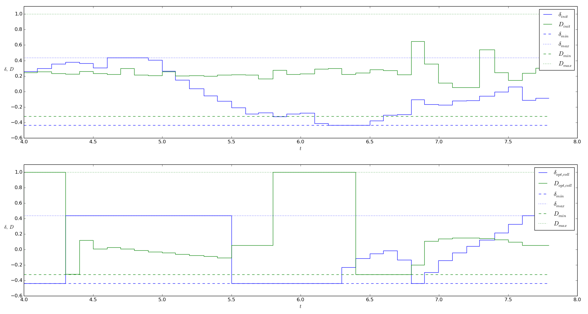
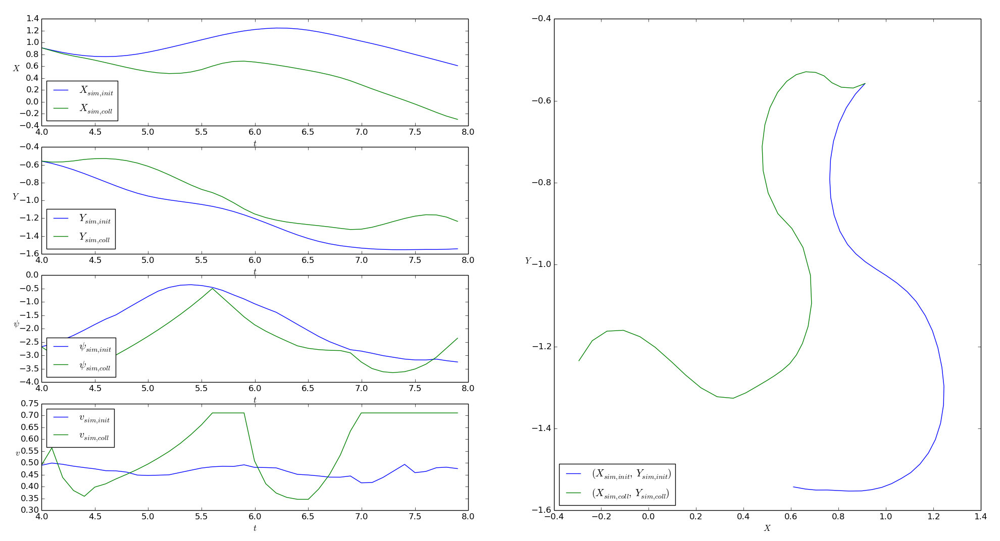

.. This file is part of casiopeia.
..
.. Copyright 2014-2016 Adrian Bürger, Moritz Diehl
..
.. casiopeia is free software: you can redistribute it and/or modify
.. it under the terms of the GNU Lesser General Public License as published by
.. the Free Software Foundation, either version 3 of the License, or
.. (at your option) any later version.
..
.. casiopeia is distributed in the hope that it will be useful,
.. but WITHOUT ANY WARRANTY; without even the implied warranty of
.. MERCHANTABILITY or FITNESS FOR A PARTICULAR PURPOSE. See the
.. GNU Lesser General Public License for more details.
..
.. You should have received a copy of the GNU Lesser General Public License
.. along with casiopeia. If not, see <http://www.gnu.org/licenses/>.

.. _samples:

Sample applications
===================

The following sample applications give hands-on impressions on how to use casiopeia in practice. They all (and some more) are contained within the `examples directory <https://github.com/adbuerger/casiopeia/tree/master/examples>`_ of the casiopeia sources.

Parameter estimation for a Lotka-Volterra predator-prey-model
-------------------------------------------------------------

The aim of the application `lotka_volterra_pe.py <https://github.com/adbuerger/casiopeia/blob/master/examples/lotka_volterra_pe.py>`_ is to estimate the unknown parameters of a Lotka-Volterra predator-prey-model for experimentally received measurement data and given standard deviations for the measurements [#f1]_. The predator-prey-model is an ODE of the form :math:`\dot{x} = f(x,p)`, given by

.. math::

    \begin{aligned}
        \dot{x}_1 &= - \alpha x_1 + \beta x_1 x_2 \\
        \dot{x}_2 &= \gamma x_2 - \delta x_1 x_2 \\
    \end{aligned}

where :math:`\alpha = 1.0` and :math:`\gamma = 1.0`, the states :math:`x` and parameters :math:`p` are defined as 

.. math::

    x = \begin{pmatrix} {x_1} \\ {x_2} \end{pmatrix}, ~ p = \begin{pmatrix} {\beta} \\ {\delta} \end{pmatrix},

and we can measure the full state, i. e.  

.. math::

    \phi = x.

The values resulting from the parameter estimation are 

.. math::

    \hat{p} = \begin{pmatrix} {\hat{\beta}} \\ {\hat{\delta}} \end{pmatrix} = \begin{pmatrix} {0.693379029} \\ {0.341128482} \end{pmatrix}.

The results for the system simulation using the estimated parameters in comparison to the measurement data are shown in the figure below.

.. figure:: lv_results.png
    :scale: 80%
    :align: center

    Figure: Simulation results for the Lotka-Volterra predator-prey-model using the estimated parameters, compared to the given measurement data

Parameter estimation for a pendulum model
-----------------------------------------

The aim of the application `pendulum_pe.py <https://github.com/adbuerger/casiopeia/blob/master/examples/pendulum_pe.py>`_ is to estimate the spring constant :math:`k` of a pendulum model for experimentally received measurement data [#f2]_. The pendulum model is an ODE of the form :math:`\dot{x} = f(x,u,p)`, given by

.. math::

    \begin{aligned}
        \dot{\nu} &= \omega \\
        \dot{\omega} &= \frac{k}{m L^2} (\psi - \nu) - \frac{g}{L} * \sin(\nu)  \\
    \end{aligned}

where :math:`m = 1.0`, :math:`L = 3.0` and :math:`g = 9.81`, the states :math:`x`, controls :math:`u` and parameters :math:`p` are defined as

.. math::

    x = \begin{pmatrix} {\nu} \\ {\omega} \end{pmatrix}, ~ u = \begin{pmatrix} {\psi} \end{pmatrix}, ~ p = \begin{pmatrix} {k} \end{pmatrix},

while the only control :math:`\psi` is the initial actuation angle of the pendulum, and therefor stays constant over time. Also, we can measure the full state, i. e. 

.. math::

    \phi = x.

The value resulting from the parameter estimation is

.. math::

    \hat{p} = \begin{pmatrix} {\hat{k}}\end{pmatrix} = \begin{pmatrix} {2.99763513} \end{pmatrix}.

The results for the system simulation using the estimated parameter in comparison to the measurement data are shown in the figures below.

..  figure:: pendulum_results.png
    :scale: 50%
    :align: center

    Figure: Simulation results for the pedulum model using the estimated parameters, compared to the given measurement data

.. _racecarpe:

Parameter estimation for a model race car
-----------------------------------------

The aim of the application `2d_vehicle_pe.py <https://github.com/adbuerger/casiopeia/blob/master/examples/2d_vehicle_pe.py>`_ is to estimate the unknown parameters of a 2D race car model for experimentally received measurement data [#f3]_. The race car and the interpretation of the model states are shown in the figure below [#f4]_.

.. figure:: rc.png
    :scale: 60%
    :align: center

    Figure: Depiction of the race car showing the models states

The 2D model of the race car is an ODE of the form :math:`\dot{x} = f(x,u,p)`, given by

.. math::

    \begin{aligned}
        \dot{X} &= v \, \text{cos}(\psi + C_{1} \delta)\\
        \dot{Y} &= v \, \text{sin}(\psi + C_{1} \delta) \\
        \dot{\psi} &= v \, \delta \, C_{2} \\
        \dot{v} &= C_{\text{m}_{1}} \, D - C_{\text{m}_{2}} \, D \, v - C_{\text{r}_{2}} \, v^{2} - C_{\text{r}_{0}} - (v \, \delta)^{2} \, C_{2} \, C_{1},
    \end{aligned}

where the states :math:`x`, controls :math:`u` and parameters :math:`p` are defined as 

.. math::

    x = \begin{pmatrix} {X} \\ {Y} \\ {\psi} \\ {v} \end{pmatrix}, ~ u = \begin{pmatrix} {\delta} \\ D \end{pmatrix}, ~ p = \begin{pmatrix} {C_{1}} \\ {C_{2}} \\ {C_{\text{m}_{1}}}  \\ {C_{\text{m}_{2}}} \\ {C_{\text{r}_{2}}} \\ {C_{\text{r}_{0}}} \end{pmatrix},

and we can measure the full state, i. e.  

.. math::

    \phi = x.

The values resulting from the parameter estimation are

.. math::

    \hat{p} = \begin{pmatrix} {\hat{C_{1}}} \\ {\hat{C_{2}}} \\ {\hat{C_{\text{m}_{1}}}}  \\ {\hat{C_{\text{m}_{2}}}} \\ {\hat{C_{\text{r}_{2}}}} \\ {\hat{C_{\text{r}_{0}}}} \end{pmatrix} = \begin{pmatrix} {  0.273408} \\ { 11.5602} \\ {2.45652} \\ {7.90959} \\ {-0.44353} \\ {-0.249098} \end{pmatrix}.

The results for the system simulation using the estimated parameter in comparison to the measurement data are shown in the figures below.

..  figure:: rc_results.png
    :scale: 70%
    :align: center

    Figure: Simulation results for the race car model using the estimated parameters, compared to the given measurement data

An evaluation of the covariance matrix for the estimated parameters shows that the standard deviations of :math:`\hat{C_{1}}` and :math:`\hat{C_{2}}` are relatively small in comparison to their own values, while the standard deviations of the other parameters are relatively big.

.. math::

    \hat{p} = \begin{pmatrix} {\hat{C_{1}}} \\ {\hat{C_{2}}} \\ {\hat{C_{\text{m}_{1}}}}  \\ {\hat{C_{\text{m}_{2}}}} \\ {\hat{C_{\text{r}_{2}}}} \\ {\hat{C_{\text{r}_{0}}}} \end{pmatrix} = \begin{pmatrix} {  0.273408} \\ { 11.5602} \\ {2.45652} \\ {7.90959} \\ {-0.44353} \\ {-0.249098} \end{pmatrix} \pm \begin{pmatrix} {0.034497452} \\ {0.058569592} \\ {2.72097859} \\ {5.448817078} \\ {1.478999406} \\ {0.37343932} \end{pmatrix}

This intends that the estimation results for the parameters  :math:`\hat{C_{\text{m}_{1}}}`, :math:`\hat{C_{\text{m}_{2}}}`, :math:`\hat{C_{\text{r}_{2}}}` and :math:`\hat{C_{\text{r}_{0}}}` are probably not accurate, and might change substantially for other measurement and control data. Optimum experimental design can be an option to encounter this problem.

Optimum experimental design for a model race car
------------------------------------------------

The aim of the application `2d_vehicle_doe_scaled.py <https://github.com/adbuerger/casiopeia/blob/master/examples/2d_vehicle_doe_scaled.py>`_ is to solve an optimum experimental design problem for the 2D race car model from `Parameter estimation for a model race car`_ to obtain control values that allow for a better estimation of the unknown parameters of the model.

Initial setup
~~~~~~~~~~~~~

For this application, we assume that we are not bound to the previous race track to obtain measurements for the race car, but can drive the car on a rectangular mat of the racetrack's material. The controls are bounded by the maximum and minimum values of the controls measurements from `Parameter estimation for a model race car`_, as well as the states are bounded by their corresponding maximum and minimum values of the states measurements. The bounds are introduced to prevent the optimizer from creating unrealistic scenarios that could e. g. cause the race car to fall over when taking too sharp turns, which is not explicitly considered within the model.

The previous parameter estimation results :math:`\hat{p}` from `Parameter estimation for a model race car`_ are used as a "guess" for the parameter values for the experimental design, and with this, to scale all parameter values within the optimization to 1.0 to prevent influences of the numerical values of the parameters on the optimization result. A subset of the control values from the previous estimation is used as initial guesses for the optimized controls. 

The quality of the initial experimental setup in terms of estimated standard deviations of the unknown parameters is evaluated as follows

.. math::

    p_\text{I} = \begin{pmatrix} {C_{1, \text{I}}} \\ {C_{2, \text{I}}} \\ {C_{\text{m}_{1},\text{I}}}  \\ {C_{\text{m}_{2},\text{I}}} \\ {C_{\text{r}_{2},\text{I}}} \\ {C_{\text{r}_{0},\text{I}}} \end{pmatrix} = \begin{pmatrix} {1.0} \\ {1.0} \\ {1.0} \\ {1.0} \\ {1.0} \\ {1.0} \end{pmatrix} \pm \begin{pmatrix} {6.1591763006} \\ {0.318683714861} \\ {92.0037213296} \\ {62.6460661875} \\ {286.556042737} \\ {108.733245939} \end{pmatrix}

which indicates that the experimental setup is rather inappropriate for a sufficient estimation.

Optimized setup
~~~~~~~~~~~~~~~

.. note:: Running this optimization takes about 10 min on an Intel(R) Core(TM) i5-4570 3.20GHz CPU.

We use the A-criterion as objective for the experimental design (see :ref:`doe`). The results of the optimization can be analyzed and visualized with the script `2d_vehicle_doe_scaled_validation.py <https://github.com/adbuerger/casiopeia/blob/master/examples/2d_vehicle_doe_scaled_validation.py>`_. The figure below shows the optimized control values in comparison to the initially used control values, while the suffix `coll` indicates that the values were obtained using collocation discretization.

    Figure: Optimized control values in comparison to the initially used control values

The figure below shows a comparison of the simulated states values for both initially used and optimized control values, and with this, the effect of the optimization on the route of the race car and it's velocity during the measurements.

    Figure: Comparison of the simulated states values for initial and optimized controls

The quality of the optimized experimental setup in terms of estimated standard deviations of the unknown parameters is evaluated as follows

.. math::

    p_\text{O} = \begin{pmatrix} {C_{1, \text{O}}} \\ {C_{2, \text{O}}} \\ {C_{\text{m}_{1},\text{O}}}  \\ {C_{\text{m}_{2},\text{O}}} \\ {C_{\text{r}_{2},\text{O}}} \\ {C_{\text{r}_{0},\text{O}}} \end{pmatrix} = \begin{pmatrix} {1.0} \\ {1.0} \\ {1.0} \\ {1.0} \\ {1.0} \\ {1.0} \end{pmatrix} \pm \begin{pmatrix} {1.93054150676} \\ {0.278656552587} \\ {1.96689422255} \\ {1.51815346784} \\ {3.42713773836} \\ {1.88475684297} \end{pmatrix}

which indicates that the optimized setup is more appropriate for parameter estimation compared to the initial experimental design. Though, the estimated standard deviations are still relatively big in comparison to the scaled parameter values, so it would probably make sense to further refine the experimental design. 

Further steps
~~~~~~~~~~~~~

Possible strategies for further refinement of the experimental design could be to increase the duration of the experiment so that more measurements can be taken, or to loosen control and state bounds to allow for greater system excitation.

In case these strategies are not applicable (physical limitations, safety concerns or alike), designing multiple experiments within one optimization problem can be a useful approach, so that several independent experiments can focus on different aspects of the system, which allows for a structured gathering of additional information about the system that can later be used within one parameter estimation.

Both planning of such experiments and using independent measurements data sets within one parameter estimation can be realized with casiopeia as well, see :ref:`multidoe` and :ref:`multipe`.

.. rubric:: References

.. Process for italic links, see: http://stackoverflow.com/questions/10669099/italicize-text-containing-a-link

.. [#f1] |linkf1|_

.. _linkf1: http://www.iwr.uni-heidelberg.de/~agbock/TEACHING/2006ws/NUM2/UEBUNGSBLAETTER/THEORIE/t09.pdf

.. |linkf1| replace:: *Bock, Sager et al.: Übungen zur Numerischen Mathematik II, sheet 9, IWR, Heidelberg university, 2006.*

.. [#f2] |linkf2|_

.. _linkf2: https://www.imtek.de/professuren/systemtheorie/events/dateien/exercise7.pdf

.. |linkf2| replace:: *Diehl, Moritz: Course on System Identification, exercise 7, SYSCOP, IMTEK, University of Freiburg, 2014/2015.*

.. [#f3] *Verschueren, Robin: Design and implementation of a time-optimal controller for model race cars, Master's thesis, KU Leuven, 2014.*

.. [#f4] *Spengler, Patrick and Gammeter, Christoph: Modeling of 1:43 scale race cars, Master’s thesis, ETH Zürich, 2010.*
